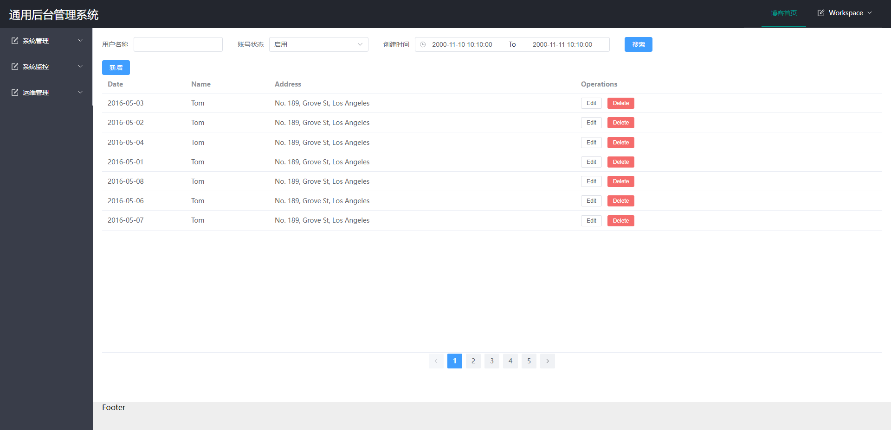

# Moonglade

一个实现*RBAC*（*Role-Based Access Control* ）的通用后台权限管理系统。

## 预览

## 技术栈

后端：Asp.Net Core WebApi + EFCore + SqlServer

前端：Vue3.x + Pinia + Vue Router + axios

[vue 仓库](https://github.com/rsdte/MoongladeUI)

